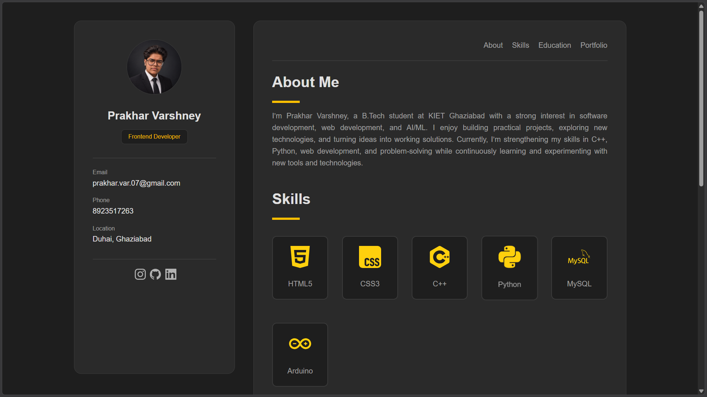

# 🌐 Personal Portfolio — Prakhar Varshney

> A modern, responsive personal portfolio website showcasing my skills, education, projects, and journey as a developer.

<p align="center">
  
  
  
  
  
</p>

---

## 👨‍💻 About The Project

This repository contains my personal portfolio website, created to showcase my **technical skills, education, projects, and development journey**.

The website presents my profile as a B.Tech CSE (AI/ML) student and frontend developer, while providing a simple way to explore my work and connect with me.

The portfolio is built using **HTML5 and CSS3**, with a clean dark-themed interface and responsive card-based sections.

---

## ✨ Features

* 🎨 Clean and modern dark-themed UI
* 👤 Personal profile section
* 📖 About Me section
* 🛠️ Technical Skills section
* 🎓 Education timeline
* 💼 Project showcase
* 📱 Social media links
* 📧 Direct email contact
* 📞 Contact information
* 🖱️ Interactive hover effects
* 📌 Sticky sidebar navigation
* 📐 Responsive grid-based layout

---

## 🧰 Technologies Used

| Technology       | Purpose                                        |
| ---------------- | ---------------------------------------------- |
| **HTML5**        | Website structure and content                  |
| **CSS3**         | Styling, layout, animations and responsiveness |
| **Git & GitHub** | Version control and project hosting            |

### Skills Showcased

* HTML5
* CSS3
* C++
* Python
* MySQL
* Arduino

These are the technologies currently represented in the portfolio's Skills section.

---

## 📂 Project Structure

```text
Portfolio/
│
├── index.html          # Main portfolio webpage
├── style.css           # Website styling
├── PV.png              # Profile image
└── README.md           # Project documentation
```

---

## 🚀 Projects

### ✈️ Travel Website

A travel-focused website designed to help users explore destinations and plan their trips according to their budget.

**Technologies:**
`HTML` `CSS`

The current portfolio describes the project as a destination and trip-budgeting website with a feedback form.

---

### 📡 Smart Attendance System

An Arduino-based attendance system that uses **RFID technology** to identify users and record attendance.

**Technologies:**

`Arduino UNO` `C++` `Wokwi` `RFID`

The portfolio currently lists the project as an RFID-based attendance system using an RFID reader.

---

## 🎓 Education

### 🎓 Bachelor of Technology — CSE (AI/ML)

**KIET Deemed to be University, Ghaziabad**
`2026 – 2030`

Currently developing skills in web development, C++, IoT and related technologies.

### 🏫 Schooling

**BLS International School, Hathras**
`2014 – 2025`

* Class 10 — **91.2%**
* Class 12 — **90.4%**

The education details above are taken directly from the portfolio source.

---

## 🎨 Design

The website follows a **minimal dark interface** built around:

* Dark gray backgrounds
* Golden accent color
* Rounded cards
* Sticky profile sidebar
* Clean typography
* Hover animations
* Grid-based project and skills layouts

The styling uses a dark `#1e1e1e` background with `#ffbf00` as the primary accent and a two-column desktop layout.

---

## 📸 Preview



## 🌱 Future Improvements

Some features I plan to add as the portfolio evolves:

* [ ] Fully responsive mobile navigation
* [ ] Project GitHub links
* [ ] Live project demonstrations
* [ ] Contact form
* [ ] JavaScript interactions
* [ ] More projects
* [ ] Downloadable resume
* [ ] Improved accessibility
* [ ] Dark/light theme toggle
* [ ] More animations and transitions

---

## 📬 Connect With Me

**GitHub:**
[@prakhar-117](https://github.com/prakhar-117)

**LinkedIn:**
[Prakhar Varshney](https://www.linkedin.com/in/prakhar-varshney-17pv07/)

**Instagram:**
[@**prakhar__varshney**](https://www.instagram.com/__prakhar__varshney__/)

**Email:**
[prakhar.var.07@gmail.com](mailto:prakhar.var.07@gmail.com)

The portfolio currently includes links to these social profiles and email contact.

---

## ⭐ Support

If you find this project interesting, consider giving the repository a ⭐ on GitHub!

---

<p align="center">
  <b>Built with HTML & CSS ❤️ by Prakhar Varshney</b>
</p>

<p align="center">
  © 2026 Prakhar Varshney. All Rights Reserved.
</p>
